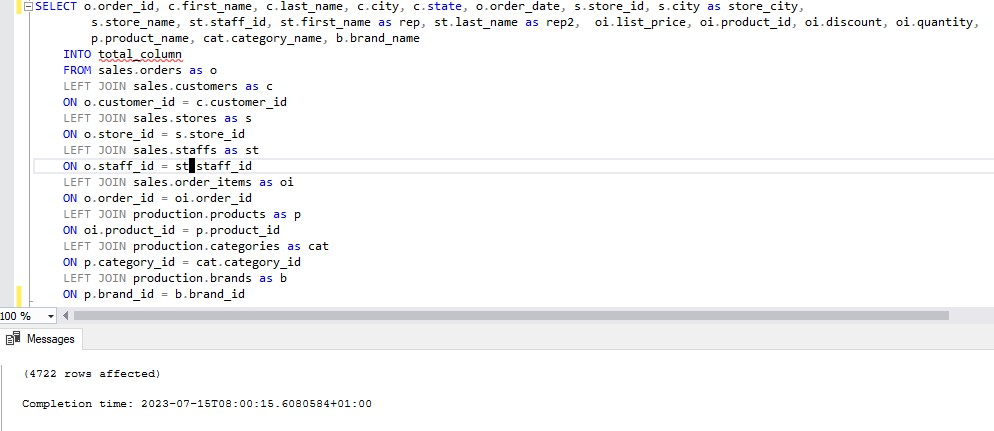
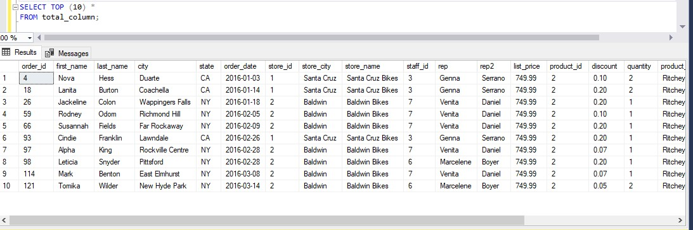
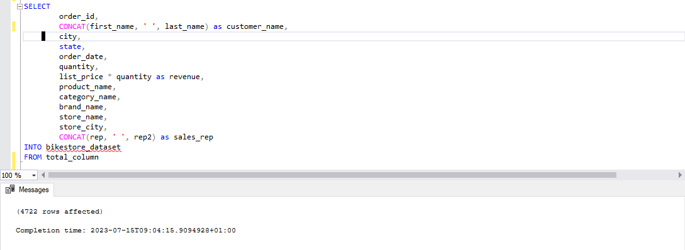
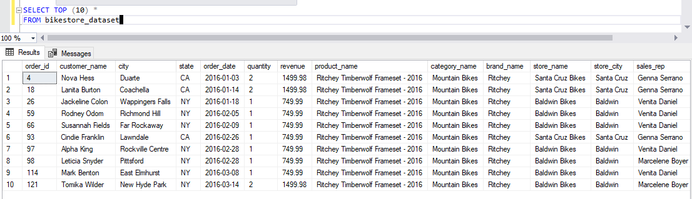
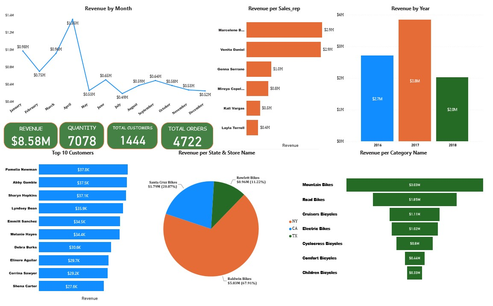

# Bikestores Analysis

### INTODUCTION 

This is a analysis of an imaginery store called **Bikestores**. The project helps analysis sales summary and help answer questions to help the store make data driven decisions.
This project is an exhibition of my skill in using SQL Server to interact with relational database and Microsoft Power BI to build beautiful visuals.

---
### DATA SOURCING

I couldn’t get the final tables I needed for this analysis so I had to create the sample database ‘Bikestores’ using SQL Server. I then had to CREATE a total of 9 tables, INSERTing  the values INTO each table. 
The database contains the following tables:

- production.brands with 9 rows and 2 columns.
-  production.categories with 7 rows and 2 columns.
-	production.products with 321 rows and 6 columns.
-	production.stocks with 939 rows and 3 columns.
-	sales.customer with 1,445 rows and 9 columns. 
-	sales.order_items with 4,722 rows and 6 columns.
-	sales.orders with 1,615 rows and 8 columns. 
-	sales.staffs with 10 rows and 8 columns. 
-	sales.stores with 3 rows and 8 columns.

---
### PROBLEM STATEMENT

1.	The stakeholders want to know the condition of sales activities within the companies and gain insights into the various trends happening in the sales volume over time.
2.	The stakeholders also wants to know the revenue per region, store, product and brand.
3.	List of top customer and sales rep would also prove useful.

---
### DATA TRANSFORMATION/CLEANING

First thing I did was to JOIN (left join) all the tables together INTO a new table (total_column), aliasing them as necessary to complete the joins. This new table consisted of 4722 rows and 19 columns.

Let’s SELECT all the columns and show only the first 10 rows

Next, we have to SELECT only the columns we need INTO a new table bikestore_dataset. The columns are:
•	order_id
•	we created a new column (customer_name), concatenating the first_name and last_name columns
•	city
•	state
•	order_date
•	quantity
•	we created a new column (revenue), multiplying the price of each item (list_price column) and the quantities bought (quantity column)
•	product_name
•	category_name
•	brand_name
•	store_name
•	store_city
•	we created a new column (sales_rep), concatenating rep and rep2 columns

Now we have our final table bikestore_dataset, consisting of 4722 row and 13 columns, which would be used for the analysis. Lets show the table, limiting it to only the first 10 rows.

### DATA ANALYSIS AND VISUALS

You can interact with the report [here] (https://app.powerbi.com/groups/me/reports/fc02f5bf-44f8-4f36-8964-570875ff335a/ReportSection)
