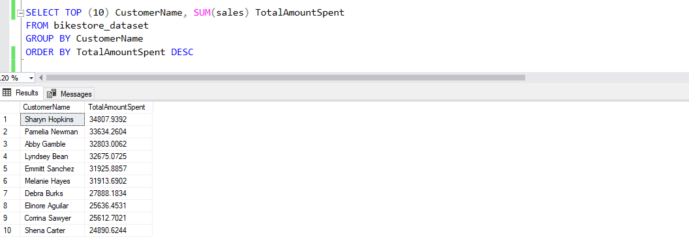

# Bikestores Analysis

### INTODUCTION 

This is a analysis of an imaginery store called **Bikestores**. The project helps analysis sales summary and help answer questions to help the store make data driven decisions.
This project is an exhibition of my skill in using SQL Server to interact with relational database.

---
### DATA SOURCING

I couldn’t get the final tables I needed for this analysis so I had to create the sample database ‘Bikestores’ using SQL Server. I then had to CREATE a total of 9 tables, INSERTing  the values INTO each table. 
The database contains the following tables:

- production.brands with 9 rows and 2 columns.
-  production.categories with 7 rows and 2 columns.
-	production.products with 321 rows and 6 columns.
-	production.stocks with 939 rows and 3 columns.
-	sales.customer with 1,445 rows and 9 columns. 
-	sales.order_items with 4,722 rows and 6 columns.
-	sales.orders with 1,615 rows and 8 columns. 
-	sales.staffs with 10 rows and 8 columns. 
-	sales.stores with 3 rows and 8 columns.

---
### DATA TRANSFORMATION/CLEANING

First thing I did was to JOIN (left join) all the tables together INTO a new table (total_column), aliasing them as necessary to complete the joins. This new table consisted of 4722 rows and 19 columns.

Let’s SELECT all the columns and show only the first 10 rows

Next, we have to SELECT only the columns we need INTO a new table bikestore_dataset. The columns are:
•	order_id
•	we created a new column (customer_name), concatenating the first_name and last_name columns
•	city
•	state
•	order_date
•	quantity
•	we created a new column (revenue), multiplying the price of each item (list_price column) and the quantities bought (quantity column)
•	product_name
•	category_name
•	brand_name
•	store_name
•	store_city
•	we created a new column (sales_rep), concatenating rep and rep2 columns

Now to see the overview of the table

Now before we jump imto analysis, this is what the first 10 rows of the table look like. Consisting of 4722 row and 13 columns.

---
### PROBLEM STATEMENT
1.	The stakeholders want to know the condition of sales activities within the companies and gain insights into the various trends happening in the sales volume over time.
2.	The stakeholders also wants to know the Revenue generated per region, store, product and brand.
3.	List of top buying customers and also top Sales Rep would also prove useful.

---
### EXPLORATORY ANALYSIS 

First, lets look at the total number of orders.                                                                                   

Total number of Transactions 

Of the total transactions of 4722, this is how it spread out across the 3 years data was collected 

This is the total number of transactions by month, April had the highest number of Transaction with a total of 669. 

#### The stakeholders would like to see the total revenue (in dollars) generated across all aspects.

2017 had the highest Sum of Revenue with $3.44M and 2018 having the least with $1.8M. Sum of Revenue trended down, resulting in a 25.25% decrease between 2016 and 2018.

At $1,21M, April had the highest Sum of Revenue and was 174.98% higher than July, which had the lowest Sum of Sales at $440,890
April accounted for 15.77% of the Total Revenue. 

What is the revenue generated across the bike's Categories?

What is the revenue generated across the bike's Brands?

What are the TOP 10 selling Products? 

How was Sales across the state and stores?

What are the TOP 10 Cities with the highest sales?

Which SalesRep made the most sales? 

Who are the highest spending Customers?

Who are the Customers with the most Transactions?

